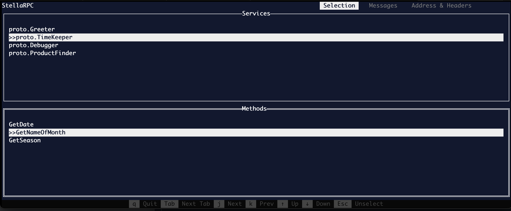
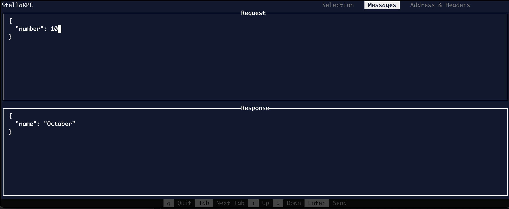

<p align="center">
    
    
</p>

## What is StellaRPC?

StellaRPC is a gRPC client that runs in the terminal! Simply put your proto files in a config and be ready to make gRPC request

## Configuration Setup

The program looks for a configuration file specified by the environment variable `STELLARPC_CONFIG`. The configuration file should be in JSON format and resembles the following:
```json
{
    "address": "http://localhost:50051",
    "includes": [
        "$HOME/your-project/protos"
    ],
    "files": [
        "grpc_simple/greeter.proto",
        "grpc_simple/timekeeper.proto"
    ]
}
```
Within this configuration, you can store a list of include directories, proto files and a default address host. Please note that these configuration options may expand in the future. In the future there will be a feature in the app that will allow you to manually edit this config.

## Demo





## Features

#### Maintain a Request Log
You now have the option to preserve your most recent request (S) and access a history of all saved requests (H), including the default template. This feature eliminates the need to ponder over the contents of your request.

#### Copy as grpcurl
stellaRPC offers the ability to copy the request data as a grpcurl command, streamlining collaboration with your peers. Simply navigate to the request page and press Ctrl+Y.

## Roadmap

- [x] List Services & Methods
- [x] Request can be edited
- [x] TLS support
- [x] Unary gRPC client calls
- [ ] Streaming gRPC client calls
- [x] Metadata specification
- [x] Server address specification
- [x] Request History
- [ ] Extended message description
- [x] Defaults of repeated/nested fields
- [x] Yank/Paste from clipboard
- [x] Yank request as grpcurl command
- [ ] Dynamically edit the config file in the app
